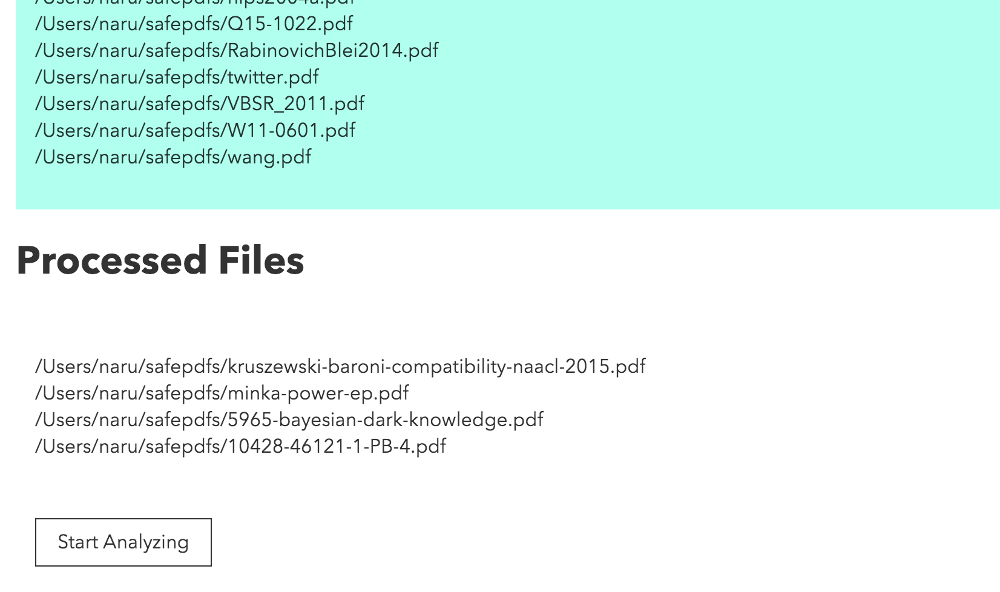
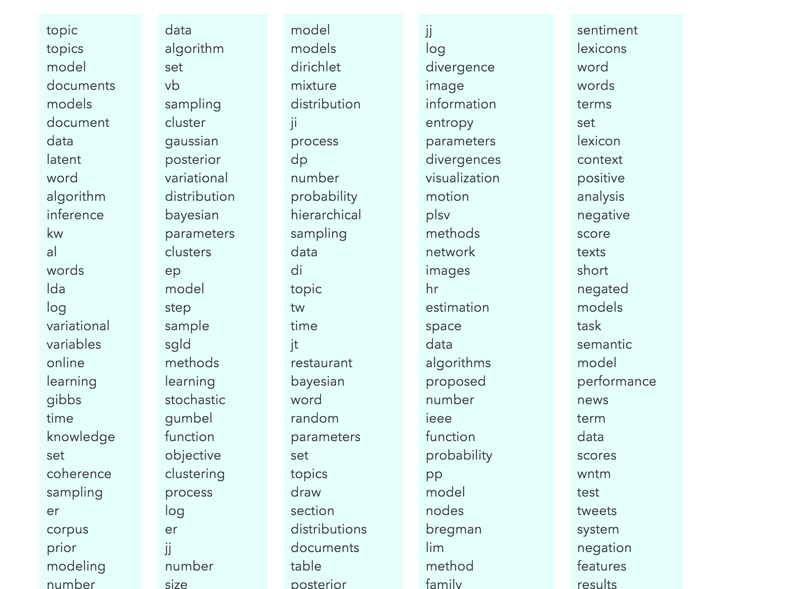

# PDFTopicker

PDFTopickerは論文など複数のPDFファイルからいくつかの「トピック」を抽出するアプリです。
トピックを用いて複数のPDFファイルを要約させることで、一つ一つのPDFファイルを見ずに全体の話題を把握することができます。
アプリケーションはElectron( http://electron.atom.io )を用いて構成されており、トピックを抽出するアルゴリズムとして
Latent Dirichlet Allocation (LDA)を用いています。またその推論手法としてKDD2013で提案されたStochastic Collapsed Variational Bayesian Inference ( http://arxiv.org/abs/1305.2452 ) という手法をJavaScriptで実装しました。


## 使い方

以下のコマンドでアプリをローカルにクローンし、起動します。(OS Xのみで動作確認済み)

```bash
git clone https://github.com/naruaway/PDFTopicker.git && cd PDFTopicker && npm install && npm start
```
アプリ起動後、上部の'drop here'と書いてあるゾーンにPDFファイルをドロップしてください。(英語のPDFのみ対応)
ドロップされたファイルに対して自動的に前処理が走り、処理済みのファイルは下部の'Processed Files'に移動します。
PDFファイルによっては処理がうまくいかず、処理が止まってしまう場合があります。このような場合はアプリを再起動して処理可能なPDFファイルのみをドロップし直してください。



分析対象としたいファイルがすべて'Processed Files'にあることを確認してから、'Start Analyzing'ボタンを押すと分析が開始します。
分析終了後、抽出された5つのトピックが表示されます。上位の単語ほどそのトピックをより特徴付ける語となっています。


## 仕様

* PDFファイルをドロップするだけでトピック分析ができる
* 普通のPCでも十分な速度で実行可能
* トピックモデルのアルゴリズムを含めてすべてJavaScript (ES2015)で実装

## 工夫した点

* 近年提案されて比較的速いLDAの推論アルゴリズムとして Stochastic Collapsed Variational Bayesian Inference ( http://arxiv.org/abs/1305.2452 )をJavaScriptで実装
* Cycle.js ( http://cycle.js.org ) を用いることでUIに関わるコードのデータフローをわかりやすくした
* PDFからの単語抽出とトピック解析にはある程度時間がかかるため、別プロセスで処理し、結果をプロセス間通信を用いて非同期に返す


## 使用技術・フレークワーク・ライブラリ

* アプリケーション全体としてElectron ( http://electron.atom.io ) を使用
* トピック分析のコードを含めてコードはすべてJavaScript (ES2015)
* UI関連のコードには Cycle.js ( http://cycle.js.org ) を採用し、Model-View-Intent で設計
* 内部のデータ構造として一部 immutable.js ( https://facebook.github.io/immutable-js/ ) を使用
* PDFから単語を抽出するためにpdf2json ( https://github.com/modesty/pdf2json ) を使用


## 既知の制約
* PDFファイルによってpdf2jsonがエラーイベントを吐かずに止まることがある。
